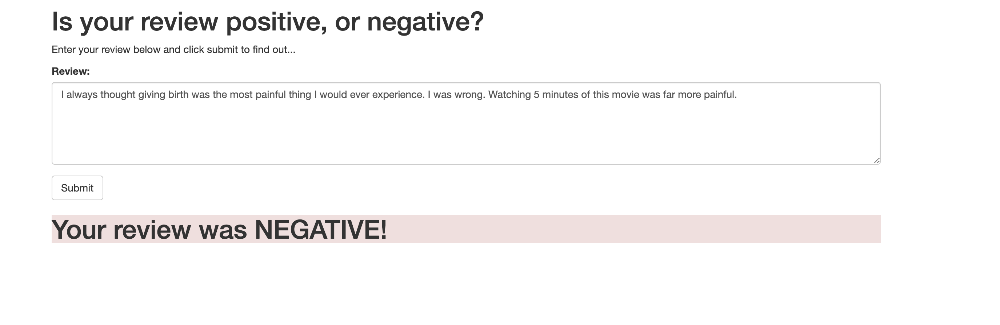

# SageMaker Deployment Project
--------------------------------------
1. [Installation](#installation)
2. [Project Motivation](#motivation)
3. [File Descriptions](#files)
4. [Results](#results)
5. [Licensing, Authors, and Acknowledgements](#licensing)

## 1. Installation 
- Pandas
- Numpy
- Sklearn
- Pytorch
- nltk
- Seaborn
- Matplotlib etc.,
- The code should run with no issues using Python versions 3.*.

## 2. Project Motivation 
For this project, I was interestested in knowing the sentiment of a review and also the process of data engineering in deploying a model.

## 3. File Descriptions   
- website/index.html: Webapp for our project
- serve: Folder consists of files for prediction
- train: Folder consists of files for training

To walk-thru the full project, check out the [notebook](SageMaker_Project.ipynb) and its [html](report.html) file .
Markdown cells were used to assist in walking through the thought process for individual steps.  

## 4. Results - WebApp 
Review that you entered in web app and the result

## 5. Licensing, Authors, Acknowledgements
Must give credit to Imdb, AWS and Udacity.

